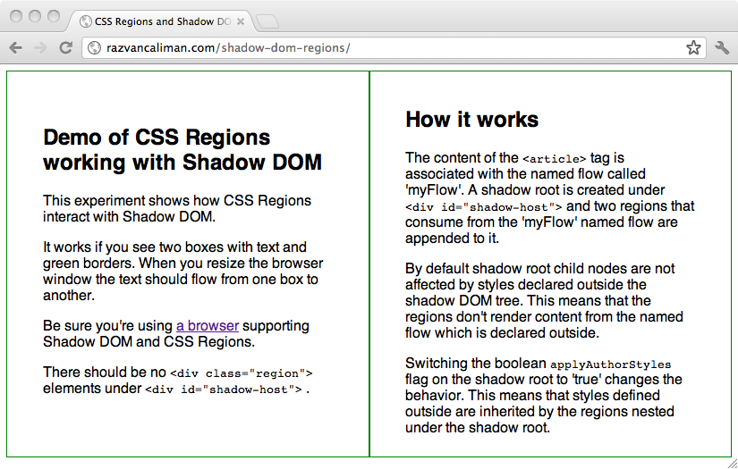

CSS Regions in Shadow DOM
=====

This is an experiment to hilight how CSS Regions interact with Shadow DOM.

**updated June 2012** 

- ShadowRoot now implements <code>applyAuthorStyles</code> flag  

- workaround using <code>scoped</code> styles no longer required 

Requirements
-----
This experiment works in a Webkit-enabled browser with Shadow DOM and CSS Regions enabled.    

At the time of this writing Google Chrome Dev channel and Google Chrome Canary builds have Shadow DOM and CSS Regions support.

[Download Google Chrome Canary](http://tools.google.com/dlpage/chromesxs)       

**How to enable Shadow DOM in Google Chrome**

* type `about:flags` into the address bar of the browser;

* find the "Enable Shadow DOM" flag and toggle it on; 

* restart the browser;    

* [test if Shadow DOM works](http://jsfiddle.net/dglazkov/eQSZd/)
                                                                               
**How to enable CSS Regions in Google Chrome**

* type `about:flags` into the address bar of the browser;

* find the "Enable CSS Regions" flag and toggle it on;

* restart the browser;

* [test if CSS Regions work](http://jsfiddle.net/vwmpX/) 
 

Expected result
-----
You should see two green border boxes with text flowing between them when the browser window is resized. 

**Screenshot of expected result**

  